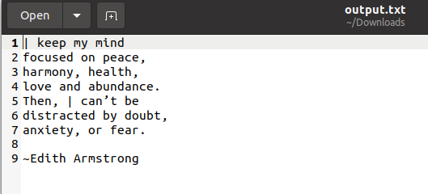
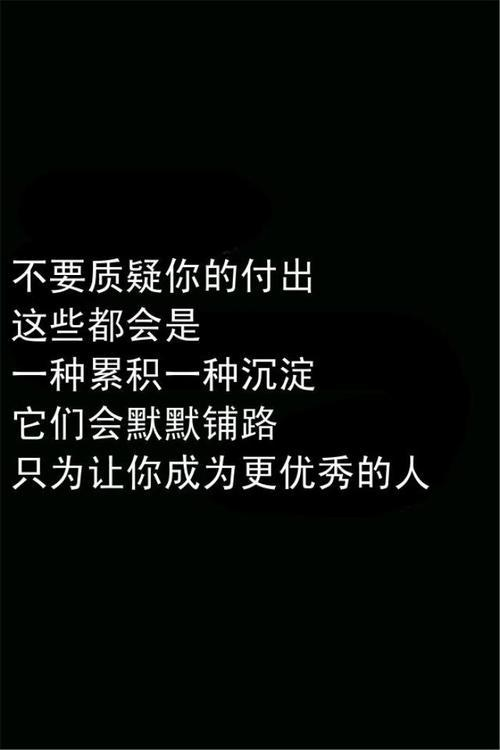
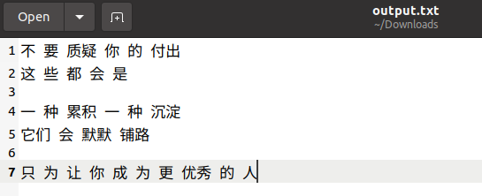

# Qualcomm® QRB2210 Open Kits ImageOCR-demo Developer documentation

## Introduce

The project builds on the QRB2210 development kit system source code and runs on the QRB2210 development board, making full use of the diverse and powerful connection and computing power of the development kit. Use Opencv to load the image, perform preprocessing such as binarization and denoising of the image, and perform text recognition processing with the preprocessed image through Tesseract-OCR, and save the result as a txt file.

It is hoped that the text information in the picture can be identified and applied to some scenarios that need to extract the information in the picture. It is expected that the Chinese and English text information in the picture can be accurately recognized, and the text information will be output for subsequent scenes.

Qualcomm® QRB2210 SoC Open Kits


## Materials and Tools used for the project

1. Hardware materials

Except for the Open Kits,The following hardware materials are also needed:

* Type-C usb line

using the usb line to develop on Qualcomm® QRB2210 SoC Open Kits.


* Charger

Direct power supply for Qualcomm® QRB2210 SoC Open Kits.


## Environment configuration

This section mainly describes the source and configuration of some open source projects or third-party tools needed in the development process.

### Opencv
OpenCV is a cross-platform computer vision and machine learning software library distributed under the Apache2.0 license (open source).  
url: https://opencv.org/

### leptonica
Leptonica's C API for advanced image processing The open-source C library enables developers to perform advanced image processing operations such as image scaling, translation, rotation, clipping in their own applications (open source).  
url: https://github.com/DanBloomberg/leptonica

### tesseract-OCR
tesseract-OCR is a free and open source image OCR text recognition engine, initially developed by HP Labs, later contributed to the open source software industry, and later improved, bugged, optimized, and rereleased by Google. It converts the text in the image you want to recognize into text according to your commands (open source).  
url: https://github.com/tesseract-ocr/tesseract

## Compile
No special compilation method is required. After configuring the RB1 special SDK, the product can be generated directly by Cmake compilation.

## Configure and Usage
Start the RB1 and connection RB1 to host by Type-c usb.
### 1. Configure
(1)Prepare English text pictures or Chinese text pictures and put them in the image_ocr executable program sibling directory;  
(2)Prepare dynamic library files required by image_ocr executable programs such as libgif.so, liblept.so, and libtesseract.so, and place them in the same directory of the image_ocr executable program;  
(3)Prepare the tesseract language model folder tessdata and place it in the image_ocr executable program sibling directory;  
(4)To execute image_ocr executable program.

### 2. Usage
The executable files in the bin directory require additional command line parameters.  
The first parameter is the image path name, which can be carried according to the actual situation;   
The second parameter is the loading image type, where 1 is an English text picture and 2 is a Chinese text picture, which can be carried according to the actual situation;

```
adb push ./english_pictire.jpg /data
adb push ./chinese_picture.jpg /data
adb push ./path/to/libgif*.so /data
adb push ./path/to/liblept*.so /data
adb push ./path/to/libtesseract*.so /data
adb push ./path/to/tessdata /data
adb push ./image_ocr /data
adb shell
cd data
./image_ocr english_pictire.jpg 1
./image_ocr chinese_picture.jpg 2
```

Please view the output file output .txt of the text recognition result separately, and execute the results twice, respectively, the Chinese and English text image recognition effects.

**result show**</br>
[english_picture_output.txt](./res/engilsh_picture_output.txt)&nbsp;&nbsp;&nbsp;&nbsp;&nbsp;&nbsp;[chinese_picture_output.txt](./res/chinese_picture_output.txt)

<div style="display:flex;justify-content:space-between;;margin-top:20px;">
  
  
</div>
<div style="display:flex;justify-content:space-between;margin-top:40px;">
  
  
</div>
